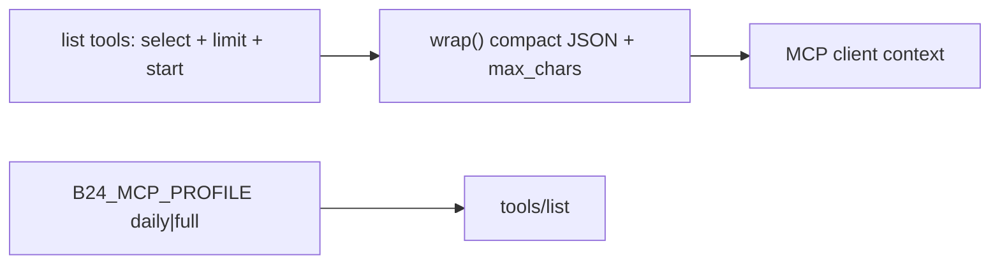

# Быстрая оптимизация токенов MCP

Имена tools, обязательные поля и смысл вызовов не меняются. Добавляются опциональные `limit`/`start`; при отсутствии `select` list перестаёт тащить все UF_*-поля (escape hatch: `select: ["*"]`). По умолчанию каталог **daily**: 4 admin-tool не регистрируются (`B24_MCP_PROFILE=full` возвращает как сейчас).

## 1. Компактный JSON и потолок ответа

В `[src/register-tools.js](src/register-tools.js)` `wrap()` сейчас делает `JSON.stringify(result, null, 2)`. Заменить на хелпер `[src/utils/mcp-response.js](src/utils/mcp-response.js)`:

- `JSON.stringify(result)` без отступов.
- Если длина > **80_000** символов (~20k токенов): укоротить известные массивы (`items`, `tasks`, `users`, `products`, `fields`, `groups`, `departments`, `events`, `calls`, `storages`, `workflows`, `result`) и добавить `truncated: true`, `returned`, `total`.
- Применяется ко всем tools, включая `b24_call` / `b24_crm_fields`.

## 2. List: default select, limit, start

Общий хелпер в `[src/utils/pagination.js](src/utils/pagination.js)` (или рядом): один Bitrix-запрос с `start`, нарезка до `limit` (default **20**, max **50**). В ответ: `count`, `total` (из Bitrix), `truncated`, `next_start`.

`all_pages: true` не отменяется, но режется потолком **200** записей + тот же char-cap в `wrap()`. Не фетчить все страницы, если `limit` укладывается в одну (50).

Подключить в list-обработчики:

| Tool                                                                                        | Default select                                                                                                                                                                                                                                   | Сейчас                   |
| ------------------------------------------------------------------------------------------- | ------------------------------------------------------------------------------------------------------------------------------------------------------------------------------------------------------------------------------------------------ | ------------------------ |
| `b24_crm_list`                                                                              | по сущности: deal/lead/quote → `ID,TITLE,STAGE_ID,ASSIGNED_BY_ID,DATE_MODIFY`; contact → `ID,NAME,LAST_NAME,PHONE,EMAIL`; company → `ID,TITLE,ASSIGNED_BY_ID`; SPA → `ID,TITLE,STAGE_ID,ASSIGNED_BY_ID`. `select: ["*"]` = как сейчас (все поля) | нет select → все UF_*    |
| `b24_tasks_list`                                                                            | уже есть; убрать лишнее не нужно                                                                                                                                                                                                                 | ок                       |
| `b24_products_list`                                                                         | без `DESCRIPTION` (как в schema comment)                                                                                                                                                                                                         | DESCRIPTION в коде       |
| `b24_users_list`                                                                            | как сейчас, **без** `LAST_ACTIVITY_DATE`                                                                                                                                                                                                         | `all_pages` default true |
| `b24_groups_list`                                                                           | `ID,NAME,ACTIVE,PROJECT` + limit вместо `fetchAllPages`                                                                                                                                                                                          | все страницы             |
| `b24_departments_list`                                                                      | limit; не тащить весь оргструктурный dump                                                                                                                                                                                                        | `fetchAllPages`          |
| `b24_calendar_list`, `b24_telephony_calls`, `b24_disk_folder_list`, `b24_products_sections` | только `limit`/`start`                                                                                                                                                                                                                           | без лимита               |

`b24_users_list`: `**all_pages` default `false**`.

## 3. Короче схемы

- `[PERSONAL_WEBHOOK_FIELD](src/utils/resolve-webhook.js)`: одна строка, например `Личный webhook для записи (иначе read-only). https://<portal>/rest/<id>/<token>/`.
- Tool descriptions `b24_disk_file_get` / `b24_disk_file_content` в `[src/register-tools.js](src/register-tools.js)`: 1–2 предложения. Длинный flow остаётся в `SERVER_INSTRUCTIONS` и в runtime-ошибке ACCESS_DENIED (`[src/tools/disk.js](src/tools/disk.js)`) — это не каталог.

## 4. Профиль daily: не регистрировать admin-tools

Выбрано: **по умолчанию daily**.

Не регистрировать:

- `b24_read_full_config`
- `b24_apply_config`
- `b24_compare_configs`
- `b24_save_user_mapping`

`B24_MCP_PROFILE=full` — все 44 как сейчас. Любое другое значение / пусто → daily (40 tools).

Экспорт `ADMIN_TOOL_NAMES` + `isDailyProfile()` из register-tools, чтобы тесты не поднимали HTTP.

Документация (счётчик tools и env):

- `[.env.example](.env.example)`
- `[AGENTS.md](AGENTS.md)` (подводные камни: профиль + compact JSON)
- `[CONNECT.md](CONNECT.md)` (44 → 40 daily)
- `[deploy/docker-compose.yml](deploy/docker-compose.yml)` — не форсировать `full` (daily как раз для Cursor на TEST/PROD). Кто пользуется apply/compare — ставит `B24_MCP_PROFILE=full` в secrets/env.

## 5. Тесты

- Новый `test/mcp-response.test.mjs` (без сети): compact stringify; truncation массива; `select: ["*"]` не подменяется дефолтом (чистая функция defaultSelect); `isDailyProfile`.
- `[test/http-smoke.mjs](test/http-smoke.mjs)`: ожидать **40** tools (daily). Если в CI когда-нибудь `full` — ветка по env.
- `npm test` в `[package.json](package.json)`: гонять и новый файл, и `readonly.test.mjs`.

Существующие имена tools и write-гард не трогать.